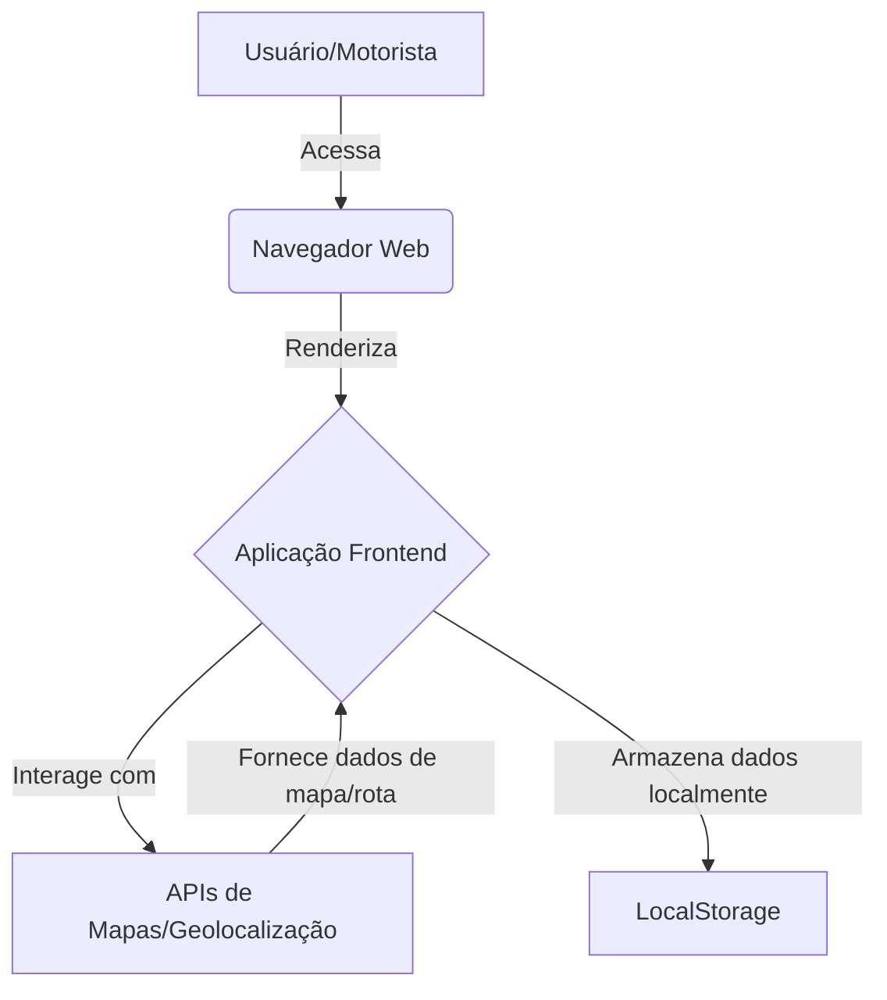

# Documento de Design do Projeto Uber-like

## 1. Introdução

Este documento descreve a arquitetura e as tecnologias a serem utilizadas no desenvolvimento de um aplicativo similar ao Uber, focado nas funcionalidades de usuário (passageiro) e motorista. O aplicativo será implantado no GitHub Pages e terá uma restrição geográfica para a cidade de Rio Pardo-RS, Brasil.

## 2. Requisitos Funcionais

### 2.1. Usuário (Passageiro)

*   **Cadastro:** Permite que o usuário crie uma conta.
*   **Login:** Permite que o usuário acesse sua conta.
*   **Seleção de Rota:** Exibe um mapa com a localização atual do usuário e permite a seleção de um destino, calculando a rota.
*   **Chamada para Motorista:** Permite que o usuário solicite uma corrida, enviando a localização e o destino para motoristas disponíveis.

### 2.2. Motorista

*   **Cadastro:** Permite que o motorista crie uma conta.
*   **Login:** Permite que o motorista acesse sua conta.
*   **Verificação de Chamadas:** Exibe as chamadas de corrida recebidas.
*   **Receber Passageiro:** Permite que o motorista aceite uma corrida e navegue até o passageiro.

### 2.3. Funcionalidades Gerais

*   **Alternância de Perfil:** Tela inicial para alternar entre o perfil de usuário e motorista.
*   **Restrição Geográfica:** O serviço de chamada de corrida será restrito à cidade de Rio Pardo-RS, Brasil.

## 3. Arquitetura Proposta

Considerando a implantação no GitHub Pages, a arquitetura será predominantemente **frontend-driven**, com o uso de APIs de terceiros para funcionalidades como mapas e geolocalização. O armazenamento de dados de usuário e motorista será simulado ou persistido localmente no navegador (LocalStorage) para simplificar a implantação sem um backend dedicado.



## 4. Tecnologias Selecionadas

### 4.1. Frontend

*   **Framework:** React.js (com Vite para um setup rápido e otimizado para GitHub Pages).
*   **Componentes UI:** Shadcn/ui (construído com Tailwind CSS e Radix UI) para componentes de UI acessíveis e personalizáveis.
*   **Estilização:** Tailwind CSS para um desenvolvimento rápido e responsivo.

### 4.2. Mapas e Geolocalização

*   **API de Mapas:** Google Maps JavaScript API ou Leaflet.js com OpenStreetMap. Para simplificar a demonstração e evitar chaves de API complexas para o GitHub Pages, Leaflet.js é uma opção mais viável inicialmente.
*   **Geocodificação/Rotas:** Para a restrição de Rio Pardo-RS, será necessário integrar uma API de geocodificação (para converter endereços em coordenadas) e uma API de rotas. OpenStreetMap Nominatim para geocodificação e OSRM (Open Source Routing Machine) para rotas são alternativas de código aberto que podem ser utilizadas sem chaves de API, mas exigem um servidor próprio ou uso de instâncias públicas com limites de requisição. Para a demonstração, podemos simular a restrição ou usar uma API gratuita com limites generosos, se disponível.

### 4.3. Gerenciamento de Estado e Dados

*   **Estado Local:** React Context API ou Zustand/Jotai para gerenciamento de estado global da aplicação.
*   **Persistência de Dados:** LocalStorage do navegador para armazenar informações de usuário, motorista e corridas em andamento. Isso simulará um banco de dados simples para a demonstração.

## 5. Estrutura do Projeto

```
/Uber
├── public/
│   └── index.html
├── src/
│   ├── assets/
│   ├── components/
│   │   ├── ui/ (componentes Shadcn/ui)
│   │   └── common/ (componentes reutilizáveis)
│   ├── pages/
│   │   ├── ProfileSelection.jsx
│   │   ├── UserLogin.jsx
│   │   ├── UserRegister.jsx
│   │   ├── UserDashboard.jsx
│   │   ├── DriverLogin.jsx
│   │   ├── DriverDashboard.jsx
│   │   └── ...
│   ├── hooks/
│   ├── lib/
│   ├── App.jsx
│   ├── main.jsx
│   └── index.css
├── .gitignore
├── package.json
├── pnpm-lock.yaml
├── vite.config.js
└── README.md
```

## 6. Próximos Passos

1.  Inicializar um novo projeto React com Vite.
2.  Instalar e configurar Tailwind CSS e Shadcn/ui.
3.  Desenvolver a tela de seleção de perfil.
4.  Implementar as telas de cadastro e login para usuário e motorista.
5.  Integrar a API de mapas e geolocalização.
6.  Implementar a lógica de chamada de corrida e aceitação.
7.  Configurar a implantação no GitHub Pages.
8.  Adicionar a restrição geográfica para Rio Pardo-RS.

## 7. Considerações de Segurança e Escalabilidade (para futuras versões)

Para uma aplicação real, seria necessário um backend robusto com banco de dados, autenticação segura (JWT, OAuth), WebSockets para comunicação em tempo real entre passageiro e motorista, e APIs de geolocalização mais avançadas com limites de requisição maiores e suporte a rotas otimizadas. A restrição geográfica seria implementada no backend para maior segurança e controle. No entanto, para o escopo atual de demonstração no GitHub Pages, a abordagem frontend-driven é suficiente.

---

**Autor:** Manus AI
**Data:** 8 de Junho de 2025

